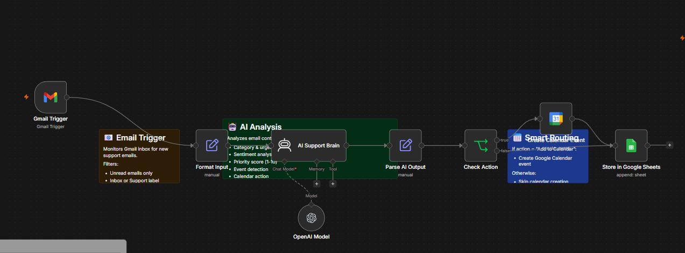
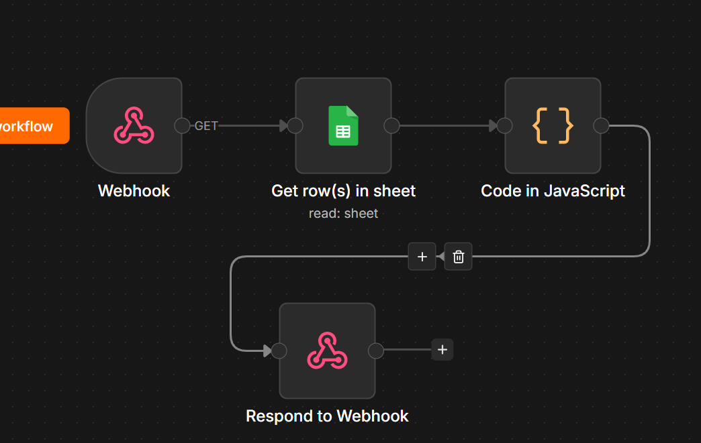

# 🔥 AI Inbox Chrome Extension

A smart AI-powered inbox that automatically analyzes, categorizes, and summarizes your emails — all inside a clean Chrome extension UI.

---

## 🚀 Features

- 📥 View emails without opening Gmail
- 🧠 AI-generated summaries
- ⚡ Urgency detection (High / Medium / Low)
- 📂 Category classification (Event, Announcement, Inquiry, etc.)
- 📅 Automatic event extraction
- 🎯 Smart filtering (tabs for priority)
- ✨ Modern UI (Glassmorphism + smooth cards)
- 🖱 Click to expand email summaries

---

## 🛠 Tech Stack

**Frontend (Extension)**
- HTML, CSS, JavaScript
- Chrome Extension (Manifest v3)

**Backend Automation**
- n8n (workflow automation)
- OpenAI API (AI analysis)

**Database**
- Google Sheets (stores processed emails)

**Integrations**
- Gmail API (email trigger)
- Google Calendar (event creation)

---

## ⚙️ How It Works

```text
Gmail → n8n Workflow → AI Processing → Google Sheets → Webhook API → Chrome Extension
## 💻 Setup Instructions (Run on Your PC)

Follow these steps to run the AI Inbox Chrome Extension locally on your system.

---

### 1️⃣ Clone the Repository

Open your terminal and run:

```bash
git clone https://github.com/yourusername/ai-inbox-extension.git
cd ai-inbox-extension
```

---

### 2️⃣ Load Extension in Chrome

1. Open Google Chrome
2. Go to:

```
chrome://extensions/
```

3. Enable **Developer Mode** (top right corner)
4. Click **Load Unpacked**
5. Select the project folder

The extension will now appear in your browser.

---

### 3️⃣ Setup Backend (n8n)

To make the extension functional, you need to configure the backend workflows:

* Create an account on **n8n (cloud or local)**
* Import or recreate the workflows:

  * Gmail Trigger workflow (email processing)
  
  * Webhook workflow (API for extension)

---

### 4️⃣ Connect Required Services

Inside n8n, connect:

* Gmail account (for email access)
* Google Sheets (to store processed data)
* OpenAI API (for AI analysis)

---

### 5️⃣ Configure Webhook API

In your extension file `popup.js`, replace the API URL:

```javascript
fetch("https://your-n8n-url/webhook/emails")
```

with your actual n8n webhook URL:

```javascript
fetch("https://your-n8n-instance/webhook/emails")
```

---

### 6️⃣ Activate Workflows

In n8n dashboard:

* Make sure all workflows are marked as:

```
ACTIVE ✅
```

Otherwise, the extension will not receive data.

---

### 7️⃣ Test the Extension

* Click on the extension icon in Chrome
* You should see:

  * Emails
  * AI summaries
  * Priority labels

If nothing appears:

* Check API URL
* Ensure workflows are active
* Verify CORS settings in n8n

---

### ⚠️ Notes

* Do NOT use `/webhook-test/` URL — use `/webhook/`
* Ensure internet connection for API calls
* Reload extension after making changes

---

### 🎉 Done!

You now have a fully working AI-powered inbox running locally on your machine.
